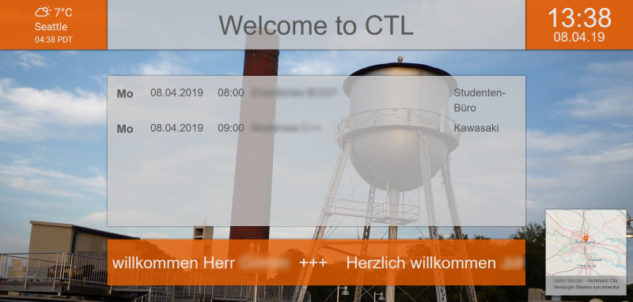

# Bildschirminformationssystem (BIS)

## Beschreibung

Das BIS ist ein Webprojekt, das Informationen als HTML Seite ausgibt.

Features:

 * Hintergrundbild mit Ortsangabe
 * Raumbelegungs-Übersicht
 * Ticker-Nachrichten
 * Geburtstags-Erinnerungen
 * Wetterdaten
 * Administrations-Oberfläche
 * Software kostenlos

## Hardware

pro Anzeige:

 * Raspberry 3 B+ (z.B. [bei Reichelt](https://www.reichelt.de/das-raspberry-pi-3-b-black-bundle-rpi3-bdl-bf-2017-p211192.html?&trstct=pos_1), Best.Nr. RPI3 BDL BF 2017, als Bundle mit SD Karte, Netzteil und Gehäuse), verbunden über Ethernet oder WLAN
 * beliebiger FullHD Bildschirm mit HDMI-Anschluss (für Dauerbetrieb mit Schutzglas und 42“ ca. 2000€)

Server:

 * Debian LAMP Server. Wir verwenden eine virtuelle Maschine mit 20 GB Festplatte und 4 GB RAM.

## Software

pro Anzeige:

 * Raspbian
 * Chromium als Browser im Kiosk Mode und per Autostart gestartet

Für die Renderung der Kartendaten wird Openlayers verwendet ([Git Repository zur API](https://github.com/openlayers/openlayers)).

Server:

 * Debian
 * Apache
 * PHP
 * MariaDB (ehemals mySQL)
 * Wetterdaemon (Teil dieses Projekts)
 * HTML + PHP Webseiten (Teil dieses Projekts)

## Installation

 * [Installation des Servers](Installation%20Server.md)
 * [Installation eines Clients](Installation%20Client.md)
 * [Anpassung](Anpassung.md)

## API

Siehe [API Dokumentation](server/API.md).